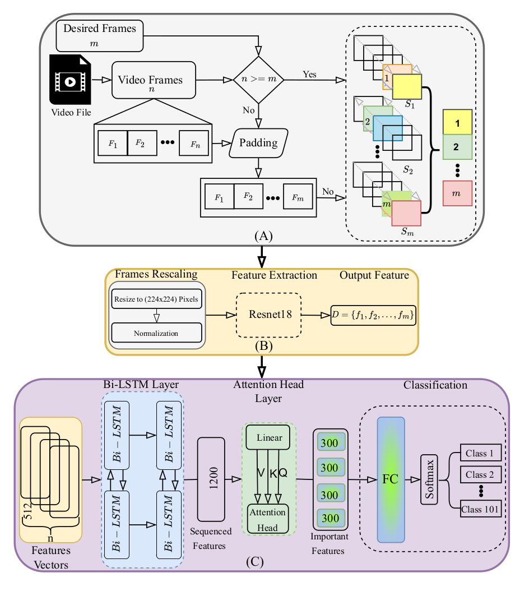

# <div align="center"> <strong>Multi-Head Attention-Based Framework with Residual Network for Human Action Recognition</strong> </div>
<p align="center">
  <a href="https://www.mdpi.com/1424-8220/25/9/2930">
    
  </a>
</p>



---

##  Overview

This repository provides the full implementation of our human action recognition framework described in the paper:

**"Multi-Head Attention-Based Framework with Residual Network for Human Action Recognition"**  
 *Sensors, 2025*  


Our framework combines:
- ✅ **ResNet-18** for extracting spatial features
- 🔁 **BiLSTM** for modeling temporal dynamics
- 🎯 **Multi-Head Attention** for motion focus
- 🌀 **Motion-based Frame Selection** via optical flow

---

## Directory Structure

```bash
HAR-ResNet-BiLSTM-Attention/
├── configs/                  # Configuration files
├── extracted_features/       # Extracted Features from row dataset
├── checkpoints/              # Saved model checkpoints
├── logs/                     # Training/validation logs and plots
├── images/                   # Visuals (model diagram, etc.)
│   └── model.png
├── scripts/
│   ├── extract_feature_nm.py    # Feature extraction (no motion consideration)
│   ├── extract_feature_wm.py    # Feature extraction (with motion consideration)
│   ├── lstm_model.py            # BiLSTM + Attention model definition
│   ├── test_on_pc_camera.py     # Test model with webcam input
│   ├── test_on_ucf101_data.py   # Evaluate model on full UCF101 test set
│   ├── test_on_one_video.py   # Evaluate model on one video from any other sources
│   └── training_model_bilstm.py # Train model with extracted features
└── README.md
```

---

## ⚙️ Setup Instructions

### 1. Clone Repository

Clone the repository to your local machine:

```bash
git clone https://github.com/basheeraltawil/HAR-ResNet-BiLSTM-Attention.git
cd HAR-ResNet-BiLSTM-Attention
```

### 2. Environment Setup

Create and activate a virtual environment:

```bash
python -m venv har-env
source har-env/bin/activate  # On Windows: har-env\Scripts\activate
```

Install required packages:

```bash
pip install -r requirements.txt
```

## 📊 Dataset Preparation

This implementation was tested on UCF101 dataset. To prepare the dataset:

1. Download UCF101 from [kaggle website](https://www.kaggle.com/datasets/matthewjansen/ucf101-action-recognition)
2. Prepare annotation folders
3. Update dataset path in config file

## 🚀 Usage

### Feature Extraction

Extract features without motion consideration:
```bash
python scripts/extract_feature_nm.py 
```

Extract features with motion consideration:
```bash
python scripts/extract_feature_wm.py 
```

### Model Training

Train the BiLSTM+Attention model:
```bash
python scripts/training_model_bilstm.py 
```

### Evaluation

Evaluate on UCF101 test set:
```bash
python scripts/test_on_ucf101_data.py 
```
Evaluate on one video from any other data sources:
```bash
python scripts/test_on_one_video.py
```

### Demo with Webcam

Test the model with your webcam:
```bash
python scripts/test_on_pc_camera.py 
```

## 📈 Results

Our method achieves state-of-the-art performance on UCF101 dataset with the following metrics:
- Accuracy: 96.6%
- F1-Score: 0.97

## 📝 Citation

If you find this work useful in your research, please consider citing:

```bibtex
@Article{s25092930,
AUTHOR = {Al-Tawil, Basheer and Jung, Magnus and Hempel, Thorsten and Al-Hamadi, Ayoub},
TITLE = {Multi-Head Attention-Based Framework with Residual Network for Human Action Recognition},
JOURNAL = {Sensors},
VOLUME = {25},
YEAR = {2025},
NUMBER = {9},
ARTICLE-NUMBER = {2930},
URL = {https://www.mdpi.com/1424-8220/25/9/2930},
ISSN = {1424-8220},
DOI = {10.3390/s25092930}
}
```

## 📄 License

This project is licensed under the MIT License - see the LICENSE file for details.

##  Original Data

- **Dataset**: [UCF101 Action Recognition Dataset](https://www.crcv.ucf.edu/research/data-sets/ucf101/)
- **Citation**: Khurram Soomro, Amir Roshan Zamir and Mubarak Shah, ["UCF101: A Dataset of 101 Human Action Classes From Videos in The Wild"](https://arxiv.org/abs/1212.0402), CRCV-TR-12-01, November, 2012.
